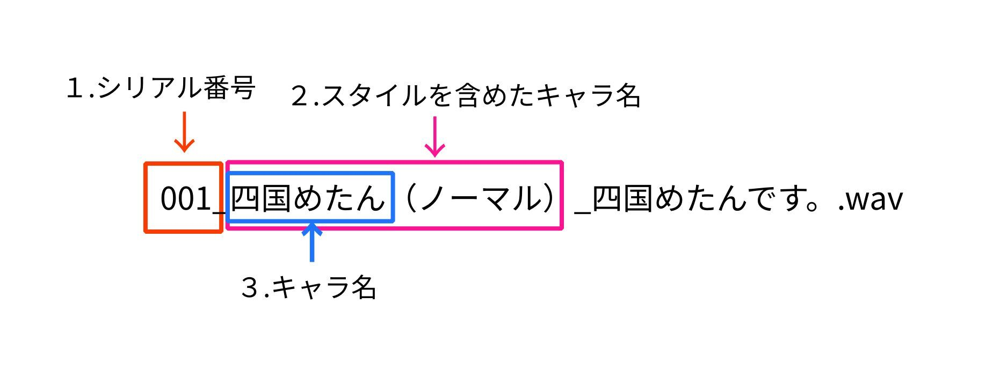

# confファイルの設定手順

読み込ませるconfファイルの記述方法について解説します。


## YAMLファイルの仕様について

この設定ファイルはYAMLという形式で記述されています。

このファイルは階層構造となっており、
親要素の下に子要素が付き、更にその子要素にさらに子要素をつけられます。

階層構造は半角スペースで表現します。
このファイルでは半角スペース2つでひとつ下の階層となります。

``` 例
info:  # 親要素
  ver: "2.3.1"   # 「info」の子要素。（半角スペース２）
  
  filedir:  # 「info」の子要素。（半角スペース２）
    voidir: "./infile"　　# 「filedir」の子要素。（半角スペース４）

```

なお、タブキーは使用できません。（これはYAML形式の仕様です）

基本的に本ツールでは連想配列形式で設定を行います。


## 読み込むファイル名について

本ツールは、音声ファイルのファイル名を見て、どの親要素内にある項目を選択するか決定しています。

項目の優先順位判定は、シリアル番号＞キャラ名（スタイル）＞キャラ名＞デフォルト の優先順位となります。



デフォルトの設定以外は、デフォルトから変更したい項目だけ記述すれば問題ありません。


## 各項目の説明

各設定項目の要素について解説します。

いくつかファイルの場所を指定する項目がありますが、
相対パスで記述する場合は、必ず「 yomixer.rb 」のある場所を起点にして記述して下さい。

### info
基礎情報

基本的な設定はこちらに設定されます。

- ver

  このYAMLファイルの構造仕様のバージョン。
  古い仕様のYAMLファイルを読み込まないようにする

  
- filedir

  ファイルの入出力先を指定する
  
  - voidir
  
    音声データを入れているディレクトリ
  
  - outdir
  
    動画の出力ディレクトリ
  
  - out_picdir
  
    立ち絵画像から動画の画面サイズの画像を生成した場合の保存場所
  
  - kugirihaihun
  
    ファイル名の区切り文字として「-」を使うかどうか指定。
  
    Voicepeakの区切り文字が「_」ではないため、それに合わせるための設定。
  
    ただし、CoeFontがシリアル番号に「-」があるため、それのときはnoにする必要がある。


### defo
デフォルトの設定

シリアル番号・各キャラ名で指定のない場合はこの項目の値が適応されます。

こちらの項目は必要がない部分を削らないで下さい。
エラーで動かなくなります。

- tatie

  立ち絵のパスを記録します。

- conp_tatie

  「tatie」で指定した立ち絵画像を、そのまま画面の大きさにするかどうか。

  すでに生成したい動画と同じサイズの画像を生成して指定している場合はyesを入れます。

- movi_w

  画面の横幅
  
- movi_h

  画面の高さ

- tatie_muki

  立ち絵が左右どちらにあるか（L=左,R=右,それ以外=中央揃え）
  
- tatie_h_p

  立ち絵を画面の高さの何％にするか指定する。

- fps: "5"

  入力される立ち絵と、出力される動画のフレームレート指定です。
  
  現在の仕様上は1にしても問題ありませんが、将来的に目や口を動かす場合には調整する必要があります。

- ena_muki

  立ち絵が左右どちらにあるか（L=左,R=右,それ以外=中央揃え）

- enatext
  
  字幕を表示するか指定（yesを入れると表示）

- enatextbord
  
  字幕のフチに色をつけるか指定定（yesを入れると表示）

- enabg
  
  字幕の背景色をつけるか指定定（yesを入れると表示）

- voice_text_fonts
  
  使用するフォントファイル

- voice_text_size
  
  フォントサイズ

- voice_text_color
  
  フォントカラー

- voice_text_bordercr
  
  フォント周りのフチの色

- voice_text_borderw
  
  フォント周りのフチの大きさ

- voice_text_bgcolor
  
  字幕の背景の色

- voice_text_bgtoumei
  
  字幕の背景の透明度
  


### kyara

各キャラの設定

デフォルトの項目からキャラごとに違う設定を行いたい場合はこちらに設定します。
ここにない場合はデフォルトの設定が使用されます。

defoよりこちらの設定が優先されます。

ここの設定はキャラの各スタイル全てに適用されます。

- 記述例

```
kyara:
  ## 該当キャラの名前
  四国めたん:
    # 立ち絵
    tatie: "./public/metan1.png"
    # フォントカラー
    voice_text_color: "#FFFFFF"
    # フォント周りのフチの色
    voice_text_bordercr: "#FF69B4"
```

これで、「四国めたん」の場合は立ち絵とフォントカラーとフォントのフチの色が変更されます。


### kyara_st

キャラ名のスタイルを指定した設定。

前項のキャラ名のみの指定で同じ項目がある場合、こちらの設定が優先されます。

- 記述例

```
kyara_st:
  四国めたん（ささやき）:
    # フォントカラー
    voice_text_color: "#F08080"
    # フォントサイズ
    voice_text_size: "8"
```

これで、「四国めたん」の「ささやき」スタイルの場合は「kyara」の設定に加えてフォントサイズも変更され、フォントカラーは「#F08080」に変更されます。


### seid
シリアル番号の設定

音声ファイルごとに違う項目を設定したい場合はこちらに記述します。

ここの設定が最も優先されます。

- 記述例

```
seid:
  "002":
    # フォントサイズ
    voice_text_size: "64"
```

これで、シリアル番号が「002」の場合はフォントサイズが「"64"」になります。


